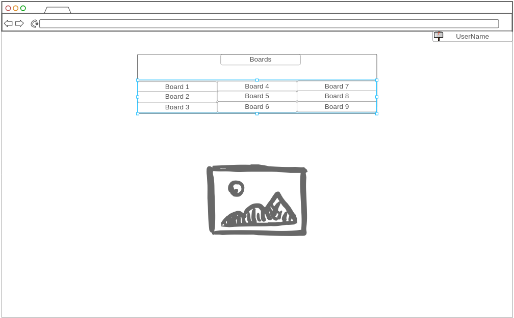
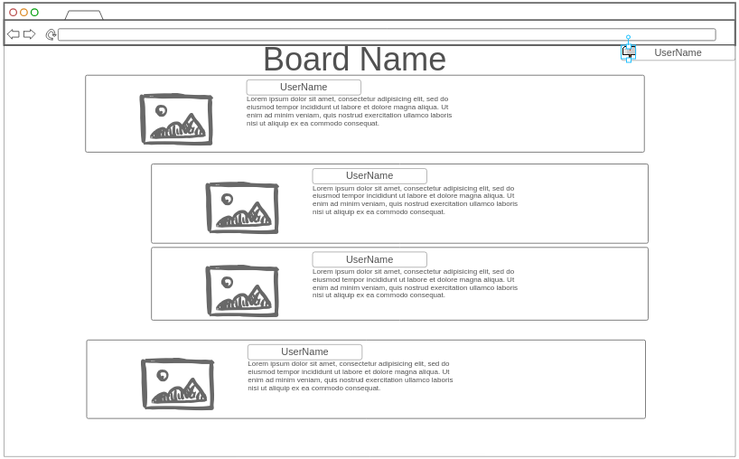

# ImageBoard

[My Notes](notes.md)

This is an image board site where users can post images to share in different themed categories.
They can also provide text to go with the image to talk about the image or whatever they want.
The categories are up to the users of the site to create.
In other words, this is supposed to be set up by other people to be self hosted.

## 🚀 Specification Deliverable

> [!NOTE]
> Fill in this sections as the submission artifact for this deliverable. You can refer to this [example](https://github.com/webprogramming260/startup-example/blob/main/README.md) for inspiration.

For this deliverable I did the following. I checked the box `[x]` and added a description for things I completed.

- [X] Proper use of Markdown
- [X] A concise and compelling elevator pitch
- [X] Description of key features
- [X] Description of how you will use each technology
- [X] One or more rough sketches of your application. Images must be embedded in this file using Markdown image references.

### Elevator pitch

I want to see if I can leverage the Fediverse to create a new social media platform for the Fediverse.
This is an image board site where users can post images to share in different themed categories.
They can also provide text to go with the image to talk about the image or whatever they want.
People can reply to posts with more images or posts.
The categories are up to the users of the site to create.
In other words, this is supposed to be set up by other people to be self hosted.

### Design

In the first image we have the simple landing page where users can select which board they want to go to.
The differnt boards are in a grid and each is a link that takes you to a different board.
There is a branding image near the bottom.

The board page is where users can see and post things.
The design is missing a post button but right now I want to get the over all look and feel right.
Replies are indented over a certain amount to indicate that they are a reply to that post or comment.

For both, the top right corner lists an icon for showing if there are any replies and menu if the user clicks on their username.

### Key features

- Interaction with the ActivityPub Protocol
- Ability to post images with text (and alt text)
- Ability to federate with other Fediverse projects like Mastodon
- Moderation tools to reduce spam, and delete "questionable" posts

### Technologies

I am going to use the required technologies in the following ways.

- **HTML** - Organize the website into key structural elements that can easily be stylized by CSS.
- **CSS** - Used to make the site look pretty and appealing to users on both desktop and mobile.
- **React** - Used to make the site be dynamic and responsive so that it can actually behave as a social media platform
- **Service** - Endpoints for
    - ActivityPub
    - Fetching Boards
    - Fetching Posts
    - Moderation tools for Moderators
    - User authentication. Logging in/out, registering, creation of moderators
- **DB/Login** - Store user posts, user information, authtokens, moderator status of users.
- **WebSocket** - Site can inform the user that they are new replies to their post.

## 🚀 AWS deliverable

For this deliverable I did the following. I checked the box `[x]` and added a description for things I completed.

- [X] **Server deployed and accessible with custom domain name** - [My server link](https://killerrabbit.click).

## 🚀 HTML deliverable

For this deliverable I did the following. I checked the box `[x]` and added a description for things I completed.

- [X] **HTML pages** - I made HTML pages for the home page, an example board, and the login screen.
- [X] **Proper HTML element usage** - I made sure to semantic tags to better inform intent.
- [X] **Links** - There is a link to each of the required pages for this deliverable.
- [X] **Text** - There is text for various places to access the website.
- [X] **3rd party API placeholder** - There are a few buttons that don't do anything because there is no api.
- [X] **Images** - I used the SVG logo I made as a placeholder for brand images as well as user images.
- [X] **Login placeholder** - I stubbed out the login/sign in page.
- [X] **DB data placeholder** - I used everyone's favorite sample text for the message body of posts.
- [X] **WebSocket placeholder** - The emoji on each page should change depending on the replies the user has received.

## 🚀 CSS deliverable

For this deliverable I did the following. I checked the box `[x]` and added a description for things I completed.

- [x] **Visually appealing colors and layout. No overflowing elements.** - I used a nice light blue as the background color to be nice and smooth. It does overflow on extremely narrow screens but at that point, the text would become illegible anyway so I think it is fine.
- [x] **Use of a CSS framework** - I used tailwind for some more more "universal" components but hand rolled CSS everywhere else. I picked tailwind because it is what our frontend team is using for my capstone project.
- [x] **All visual elements styled using CSS** - I used css to target everything and fit the theme that I am going for.
- [x] **Responsive to window resizing using flexbox and/or grid display** - I used a lot of flexbox and a little bit of grid.
- [ ] **Use of a imported font** - I did not complete this part of the deliverable.
- [x] **Use of different types of selectors including element, class, ID, and pseudo selectors** - I used a bunch of different selectors, although I think I mostly used ID to meet the requirements more than anything.

## 🚀 React part 1: Routing deliverable

For this deliverable I did the following. I checked the box `[x]` and added a description for things I completed.

- [ ] **Bundled using Vite** - I did not complete this part of the deliverable.
- [ ] **Components** - I did not complete this part of the deliverable.
- [ ] **Router** - I did not complete this part of the deliverable.

## 🚀 React part 2: Reactivity deliverable

For this deliverable I did the following. I checked the box `[x]` and added a description for things I completed.

- [ ] **All functionality implemented or mocked out** - I did not complete this part of the deliverable.
- [ ] **Hooks** - I did not complete this part of the deliverable.

## 🚀 Service deliverable

For this deliverable I did the following. I checked the box `[x]` and added a description for things I completed.

- [ ] **Node.js/Express HTTP service** - I did not complete this part of the deliverable.
- [ ] **Static middleware for frontend** - I did not complete this part of the deliverable.
- [ ] **Calls to third party endpoints** - I did not complete this part of the deliverable.
- [ ] **Backend service endpoints** - I did not complete this part of the deliverable.
- [ ] **Frontend calls service endpoints** - I did not complete this part of the deliverable.
- [ ] **Supports registration, login, logout, and restricted endpoint** - I did not complete this part of the deliverable.

## 🚀 DB deliverable

For this deliverable I did the following. I checked the box `[x]` and added a description for things I completed.

- [ ] **Stores data in MongoDB** - I did not complete this part of the deliverable.
- [ ] **Stores credentials in MongoDB** - I did not complete this part of the deliverable.

## 🚀 WebSocket deliverable

For this deliverable I did the following. I checked the box `[x]` and added a description for things I completed.

- [ ] **Backend listens for WebSocket connection** - I did not complete this part of the deliverable.
- [ ] **Frontend makes WebSocket connection** - I did not complete this part of the deliverable.
- [ ] **Data sent over WebSocket connection** - I did not complete this part of the deliverable.
- [ ] **WebSocket data displayed** - I did not complete this part of the deliverable.
- [ ] **Application is fully functional** - I did not complete this part of the deliverable.
